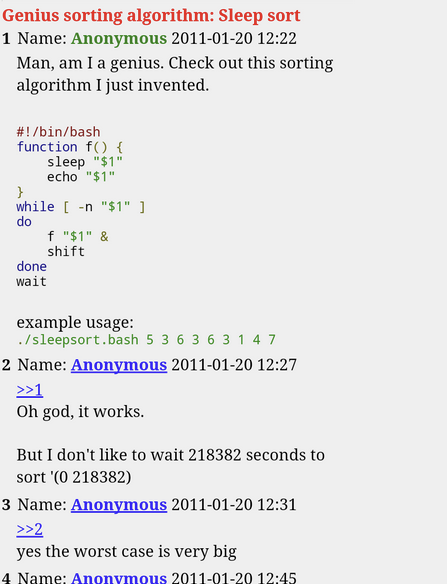
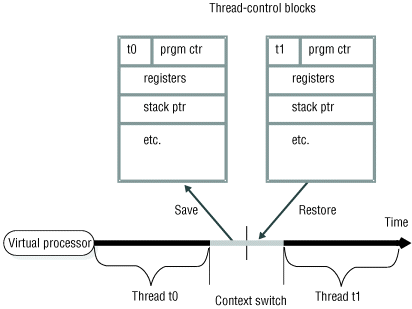
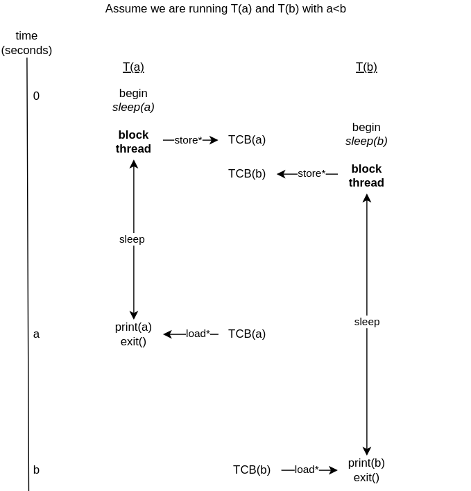

# Preface
---

Find all code used in the jupyter notebook here: [INSERT-LINK-HERE]

# Introduction

---

I'm not entirely sure how I stumbled on to this, but I found out that long ago some 4chan user claimed to have created a $O(n)$ sorting algorithm. Here is the original thread:



The main idea is that you sleep for the amount of time represented by the item in the array. So the smaller elements get in the result faster, and hence in sorted order!

Converting the bash code to pseudocode, this is what it roughly translates to:

```python
sort(L):
    for each element x of L:
        create this background process:
            sleep for x seconds
            print x
```

Genius, right? If you input `3 1 2` this is what would happen:

```python
time(s):   0            1            2            3
           <--------------sleep-------------->  print(3)
           <-sleep->  print(1)    
           <--------sleep--------> print(2)        
```
As you can see, the numbers printed in order! Hooray! Nice sorting! Or is it?


<details>
<summary> Why is O(n) sorting a big deal?</summary>

One fact echo'd almost everywhere about sorting is that the best you can do is $O(n \log n)$. This is true for **comparison-based** sorting.

## Comparison-based sorting
This is the type of sorting which involves directly comparing elements of the original array with one another, and it has been proven that this cannot go faster than $O(n \log n)$. 

<details>
<summary>A small proof</summary>

An array with $n$ items can have at most $n!$ arrangements (or permutations).
In a comparison-based sorting algorithm, we must perform **at least** $\log (n!)$ comparisons.

The reason for this is that each "comparison" is essentially a yes/no decision about which element to chose, so the question can be reframed as: _how many comparisons do I need to uniquely identify the right permutation?_\
If you can make $d$ yes/no decisions, the number of possible outcomes is $2^d$\
We also know the total number of possible outcomes is $n!$, so $2^d\; = n! \implies d = \log (n!)$

Also, \
$\log(n!) = \sum\limits_{i=1}^{n}\;\;\;\;\log(i) \le n \log(n)$

So the lower-bound of comparison-based sorts is $\Omega(n \log n)$ in the worst case
</details>


## Non-comparison based sorting
While it is true that most basic sorting algorithms cannot be faster than $O(n \log n)$, there are certain algorithms which can go as fast as $O(n)$ (eg. Bucket Sort and Radix Sort. Look them up!)

So why aren't these the hero sorting algorithms? The answer is simple: *they make a lot of implicit assumptions* and *work well in very specific cases!* 
- Something like Radix sort consumes a lot of memory and is generally less flexible as it is based on digits and letters
- Something like Bucket sort works the best when data is more-or-less evenly distributed. 

And both of these could go as bad as $O(n^2\;)$ if their assumptions aren't met - however, what is true that these algorithms can and will be used when they fit best!

**Conclusion:** So you cannot generally do better than $O(n \log n)$ if you make no assumptions about your input data!


</details>


# Back to sleep sort
---

Sooooo is sleep sort better than all the algorithms seen before?? Is it really $O(n)$? To get into this, I want to deep dive into the OS details of why this isn't as good and do some numerical analysis.


## Waiting `x` seconds

Could be insanely high in terms of *seconds*, forget time complexity. If an element is 1000, it's a 16 minute wait! Merge sort would never!


*MAYBEEEEE* - For array `L`, using scaling factor to scale `x` to `x / max(L)` as the wait time to bring all the sleeps in `[0,1]` seconds $\to$ shorter wait times??
- Well, yes, but now you've lost correctness. If this worked as theoretically stated, we could scale it down even further and get super low run times! 
- The problem is that computers can normally not guarantee sleep times with accuracy more than 1ms $^{[1]}$

So there is a small implicit assumption here! We need all scaled down numbers to be less than 0.001 (which represents 1ms). This can be guaranteed in arrays $L$ which have:
$$
\dfrac{\min(L)}{\max(L)}\;\;\;\;\;\;\;\;\;\;\;\; > 0.001
$$
> The 1ms value is true for non real-time Linux kernels (which is what I am using), but the inquality above can be modified to fit whatever OS you are using! I will continue using 1ms in the blog, but the idea extends to all OS's.


Look at the [jupyer notebook](insert-link-here) and see how this inaccuracy plays out!


## Thread memory overhead
Each thread allocates its own stack in virtual memory allocated for it - could theoretically go really high. Depending on the system, the stack size of a thread could be up to 4MB. $^{[2]}$ \
This means that for an array of 1000 elements, it could take up to 4GB of memory! It scales linearly, and can go up to 40GB for 10000 elements! That is completely unreasonable in terms of space complexity for a sorting algorithm.

Remember that this is a problem since the number of threads created is exactly equal to the number of elements in the array, so it doesn't seem like a very scalable solution.

## Context switching

Switching between threads requires context switching, which is expensive. The more threads that run, the more context switches are required to give the illusion that they all ran concurrently. 

<details>
<summary>What are context switches? Why?</summary>

A computer with a single processor cannot actually run multiple threads "concurrently" as you might expect. It needs to keep switching between the steps of the threads. 
- The reason we require context switches is to ensure that when we run a thread, we *resume* it from the right point.
- For example if you partially ran a thread, switched to another one and came back to run the original thread, you want to run it from where you left of.
- The way the OS keeps track of the "state" or "the place to resume from" is a data structure called the **Thread Control Block (TCB)**. You can just think of this as a high-level abstraction for now.
  - An important piece of information stored in the TCB is the **[Program Counter (PC)](https://en.wikipedia.org/wiki/Program_counter)** which is an indication of where in its code the thread has already reached. Every program maintains a PC to know what to execute next.

Whenever a context switch happens between two threads $T_0\;$ and $T_1\;$, the following steps happen:
1. Save the state of $T_0\;$ in a TCB
2. Load the state of $T_1\;$ from its TCB

Look at the diagram for more details:



</details>


In our example, the thread we want to run in threads is the following function:
```python
T(x):
    sleep(x)
    print(x)
```

Let's say we run $T(a)$ and $T(b)$ which sleep for $a$ and $b$ seconds respectively and then print. Also let's assume $a<b$. The following is a possible schedule of running the 2 threads:



Hooray! They're running concurrently! This looks lightweight enough, right? \


Well it wasn't free (obviously). The main costs come from:
- The memory overhead that arises from the TCB's that need to be saved and restored over and over - they are saved in the memory of the CPU
- The time overhead comes from the following:
  - Saving the context of a thread before interrupting it causes latency. The data that needs to be saved includes various things like the program counter, registers, stack pointers, etc. which takes time
  - Restoring contexts is equally time consuming
  - There is also overhead from the scheduler to determine what to run next. Since most scheduling algorithms use **priority queues** to determine what to run next, reading the highest priority element in the queue can be costly, especially if the number of threads is large. 

Now in the case of 2 threads it doesn't seem like a lot, but costs add up fast the more threads you add. And the whole point of being a fast algorithm is to run well on larger inputs :)

<details>
<summary>How this scales...</summary>

Let's bash out the math for an array $L$ which is some permutation of $\set{x_1, \ldots, x_n\;}$ with $x_1\; < \ldots < x_n$

So the threads we will need to run will be $T(x_1\;), \ldots, T(x_n\;)$ with $x_1 < \ldots < x_n$. 
- Let's also assume for the sake of simplicity that none of the $x_i\;$'s are equal to one another, or in other words all elements of $L$ are unique

Then we can calculate the number of context switches in the following way:
1. **Sleep + Wake-up**: For each of the $n$ threads, there needs to be 1 context switch when sleeping and 1 context switch when waking up (and performing `print`), ie. 2 context switches per thread.
   - So for all the threads combined, this constitutes $2n$ context switches.
2. **Extra costs:** For each thread created, there would be more overlaying costs depending on the system.
   - This could be during the thread creation and thread joining (2 per thread; total $2n$)
   - This could be during printing to stdout (1 per thread; total $2n$)
   - This could be during interrupts (1 per thread; total $n$)

So the total cost is of the order $C(n) = 2n + O(n)$. Since the time of this thread increases linearly as the number of threads (aka number of elements) increases, it could be potentially expensive.

</details>


Now, ask yourself: is it worth asking your OS to do ALL this just to sort an array?

# The time cost comparison
---
After some intense scientific research (wrote some code) to find out how slow or fast sleep sort can be (I just ran it and measured it in Python), here are my results! I tested 3 functions:
1. Python's in-built `sorted` function 
2. `sleep_sort()` - which implements the sorting algorithm originally created by the 4chan user
3. `scaled_sleep_sort()` - which was implemented by the scaling method discussed earlier of scaling all elements down to `x/max(L)` and waiting that long. I used only valid array inputs.
    - As discussed in the earlier, valid inputs for this are those where `min(L)/max(L) > 0.001`, since `sleep` works accurately when the sleep time higher than 1ms.


I ran all 3 of them with the input array `[5,3,1,2,4]` and the results were:
 
| Algorithm | Time (seconds) |
|-|-|
|Python's `sorted` |  $1.525 \times 10^{-4}$  |
|`sleep_sort` | 5.006 |
|`scaled_sleep_sort` | 1.002 |

Check out the [Jupyter Notebook](insert-link-here) to see how I measured and implemented these!

Even with using the scaling optimization, it is not even close to the run time of faster sorting algorithms, even for such small inputs! 


# Wrap up
---
I may have slightly click-baited you at the start there - the 4chan user never explicitly said this was $O(n)$; the rest of the internet did after they posted this.
Some people argued that the time complexity is actually $O(n \cdot \max(L))$ (since each thread waits upto `max(L)` seconds!), others brought up the point with threads that I did.\
While studying this case, there are some things I took away from this:
1. **Time complexity isn't everything!** Just because something has a shiny runtime doesn't mean it's not hiding things! Always try to understand whether the time complexity is in a general-case or if it has hidden assumptions.
2. **Threads aren't free!** Most applications nowadays run on multi-threaded concurrent programs, and while they offer a really cool abstraction for running things concurrently, it's important to always consider the cost of these!
3. **Meme case study?** While this case study was picked up from a 4chan thread of all places, and it isn't even in a credible algorithm, sometimes analyzing bad algorithms and doing a deep dive is what gets you to learn new things! I did a lot of research about how threads and context switches work and tried to write it in an approachable way :D

# Sources
---
1. **Accuracy of python `time.sleep`:** https://stackoverflow.com/questions/1133857/how-accurate-is-pythons-time-sleep
2. **Linux thread creation:** https://man7.org/linux/man-pages/man3/pthread_create.3.html

> PS. if you read this blog, thank you! I'd appreciate any feedback or thoughts if you'd like to share them :D Feel free to connect with me wherever!


